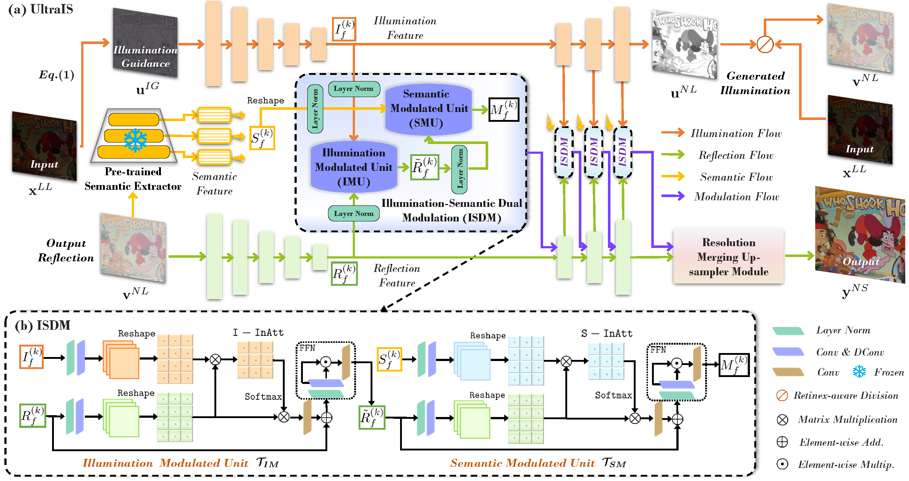

# [TNNLS 2024] A Dual-Stream-Modulated Learning Framework for Illuminating and Super-Resolving Ultra-Dark Images [[Paper]](https://ieeexplore.ieee.org/abstract/document/10614925)
By Jiaxin Gao, Ziyu Yue, Yaohua Liu, Sihan Xie, Xin Fan, Risheng Liu

## Pipeline


## Dependencies
```
pip install -r requirements.txt
````

## Download the raw training and evaluation datasets
### Paired dataset 
RELLISUR dataset: Andreas Aakerberg, Kamal Nasrollahi, Thomas Moeslund. "RELLISUR: A Real Low-Light Image Super-Resolution Dataset". NeurIPS Datasets and Benchmarks 2021. [RELLISUR](https://vap.aau.dk/rellisur/)

### Unpaired dataset 
Please refer to DARK FACE dataset: Yang, Wenhan and Yuan, Ye and Ren, Wenqi and Liu, Jiaying and Scheirer, Walter J. and Wang, Zhangyang and Zhang, and et al. "DARK FACE: Face Detection in Low Light Condition". IEEE Transactions on Image Processing, 2020. [DARK FACE](https://flyywh.github.io/CVPRW2019LowLight/)

Please refer to Dark Zurich dataset: Christos Sakaridis, Dengxin Dai, Luc van Gool. "Guided Curriculum Model Adaptation and Uncertainty-Aware Evaluation for Semantic Nighttime Image Segmentation". ICCV, 2019. [Dark Zurich](https://www.trace.ethz.ch/publications/2019/GCMA UIoU/)


## Pre-trained Models 
You can download our pre-trained model from [[Google Drive]](https://drive.google.com/drive/folders/1m3t15rWw76IDDWJ0exLOe5P0uEnjk3zl?usp=drive_link) and [[Baidu Yun (extracted code:cjzk)]](https://pan.baidu.com/s/1fPLVgnZbdY1n75Flq54bMQ)

## How to train?
You need to modify ```datasets/dataset.py``` slightly for your environment, and then
```
python train.py  
```

## How to test?
```
python evaluate.py
```

## Visual comparison


## Citation
If you use this code or ideas from the paper for your research, please cite our paper:
```
@article{10614925,
  title={A Dual-Stream-Modulated Learning Framework for Illuminating and Super-Resolving Ultra-Dark Images},
  author={Gao, Jiaxin and Yue, Ziyu and Liu, Yaohua and Xie, Sihan and Fan, Xin and Liu, Risheng},
  journal={IEEE Transactions on Neural Networks and Learning Systems },
  pages={1-14},
  year={2024},
  publisher={IEEE}
}
```

## Acknowledgement
Part of the code is adapted from previous works: [Restormer](https://github.com/swz30/Restormer) and [MIRNet](https://github.com/swz30/MIRNet) (code structure). We thank all the authors for their contributions.

Please contact me if you have any questions at: jiaxinn.gao@outlook.com

